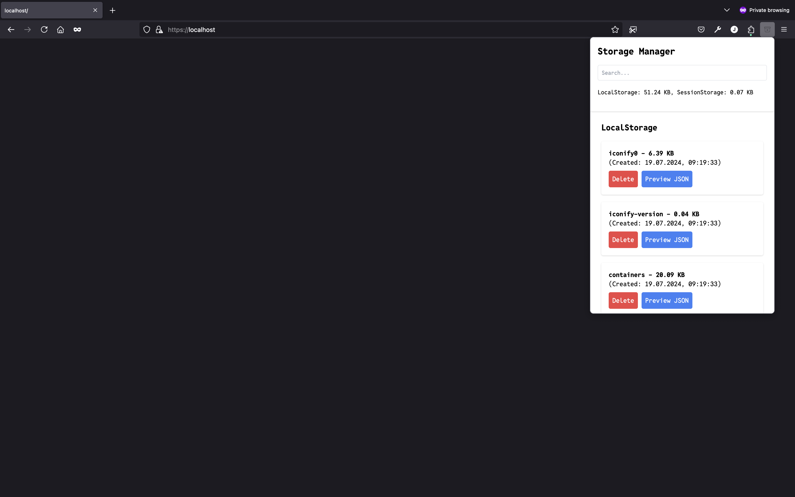

# Browser Storage Manager

A Firefox browser extension to manage LocalStorage and SessionStorage items, display their details, and allow for item deletion and JSON content preview.



## Features

- Display all LocalStorage and SessionStorage items with their sizes, creation dates, and content.
- Delete specific LocalStorage or SessionStorage items.
- Preview JSON content in a formatted view.
- Search for specific storage items.

## Installation

1. Clone the repository:

    ```bash
    git clone https://github.com/MarJC5/browserstore.git
    ```

2. Navigate to the extension directory:

    ```bash
    cd browserstore
    ```

3. Load the extension in Firefox:
    - Open Firefox and navigate to `about:debugging`.
    - Click on "This Firefox" (or "Load Temporary Add-on").
    - Click "Load Temporary Add-on" and select the `manifest.json` file from the extension directory.

## Usage

1. Click the extension icon to open the popup.
2. The popup will display the total size of LocalStorage and SessionStorage, along with a list of their items.
3. Use the search input to filter storage items by key.
4. Click the "Delete" button next to an item to remove it from storage.
5. Click the "Preview JSON" button to view the JSON content of an item in a formatted modal.
